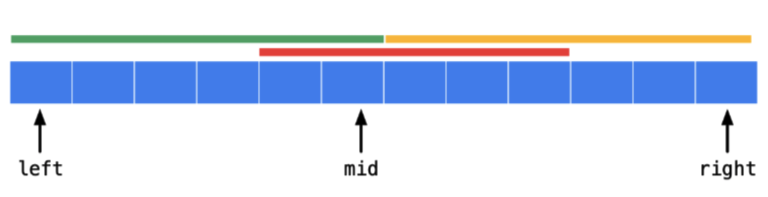

[Leetcode Link](https://leetcode.com/problems/maximum-subarray/description/)


## 🗒️ Problem Description

Given an integer array `nums`, find the 
subarray with the largest sum, and return *its sum.*

## 📌 Example
#### Example 1:
```
Input: nums = [-2,1,-3,4,-1,2,1,-5,4]
Output: 6
Explanation: The subarray [4,-1,2,1] has the largest sum 6.
```
#### Example 2:
```
Input: nums = [1]
Output: 1
Explanation: The subarray [1] has the largest sum 1.
```

## 📌 Constraints:
- `1 <= nums.length <= 105`
- `104 <= nums[i] <= 104`

## 🤔 How to solve the problem(1)
- ***Negative prefix*** is not helpful to make the sum bigger

- So, shift left pointer if we have negative prefix!

### 💡 Complexity of the solution
- **Time Complexity**: `O(n)` 

## 🪄 Follow up
 If you have figured out the `O(n)` solution, try coding another solution using the **divide and conquer** approach, which is more subtle.


## 🤔 How to solve the problem(2) - **Divide and Conquer**
After splitting into two sub arrays, in addition to the max sum in each sub array, we need also consider the case that contains the both left tail and right head element. As in graph shown below:



1. **(Green)**: Max sum from left sub array.
2. **(Orange)**: Max sum from right sub array.
3. **(Red)**: Max sum which must include both left tail (mid) and right head (mid + 1).

The first two can be obtained by directly calling recursive function.
For the 3rd one, we can start from tail/head and iterate through the entire sub array to get the max sums. Then we can add them together and compare with the two sums from #1 and #2.

### 📝 Pseudo Code
```
MaxSubArray(A, p, r)

if p==r: return A[p]
q = (p+r)//2
L = MaxSubArray(A, p, q)
R = MaxSubArray(A, q+1, r)
C = MaxCrossingSubarray(A, p, q, r)

Return Max(L,R,C)
``` 


### 💡 Complexity of the solution
- **Time Complexity**: `O(nlogn)` 